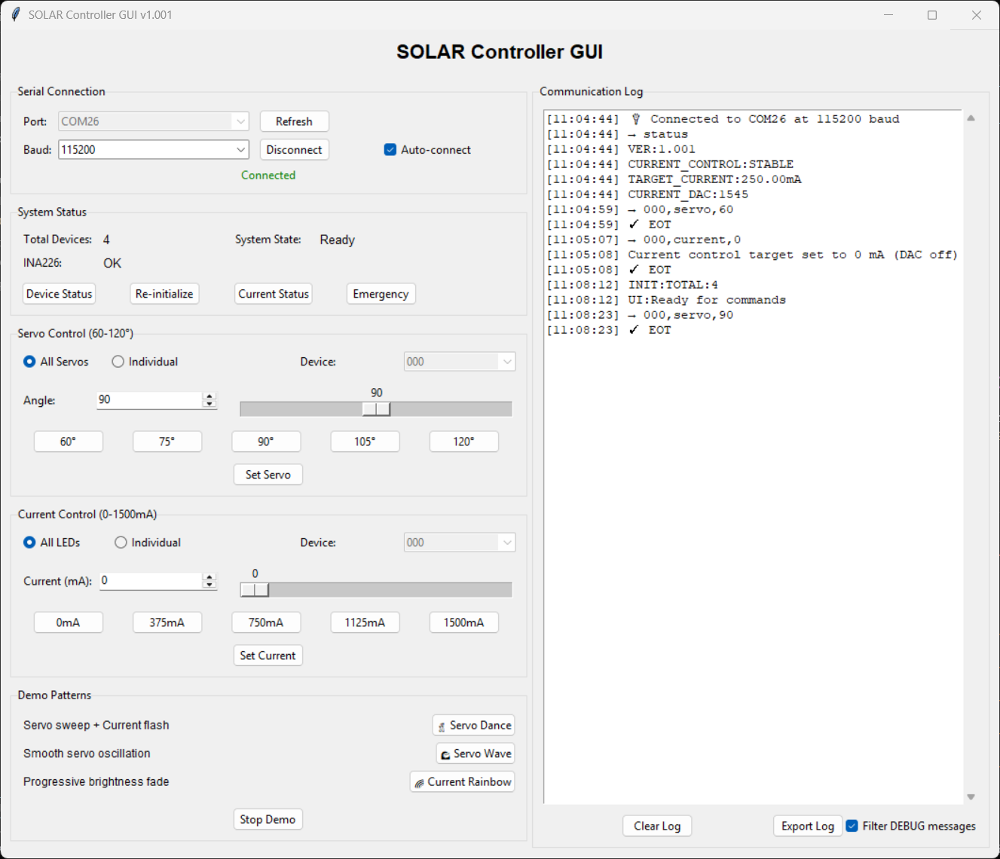

# SOLAR GUI

A Python GUI application for controlling ItsyBitsy M4 boards in a daisy-chained round-robin communication system with INA226 current monitoring. This application provides precise control over servo motors and LED arrays through current-based control with real-time monitoring and safety features.



## Overview

The SOLAR Controller GUI enables seamless control of multiple ItsyBitsy M4 boards arranged in a daisy chain. Each board can control a servo motor (60-120 degrees, safety limited) and an LED array via 12-bit DAC output with INA226 current monitoring (0-1500mA current control, safety limited). The system uses a round-robin communication protocol where commands are passed from one device to the next, allowing for both synchronized and individual device control with real-time current feedback.

## 🚀 What This System Does

This GUI controls a smart chain of ItsyBitsy M4 controllers that can:
- Control LED brightness on multiple devices simultaneously or individually with current-based control
- Move servo motors to precise positions (60-120 degrees)  
- Monitor real-time current consumption using INA226 sensors
- Communicate through a daisy-chain setup with automatic device detection
- Provide comprehensive safety features including overcurrent protection and voltage drop detection
- Run entertaining demo patterns for testing and demonstration
- Automatically populate system status upon connection

Think of it as a "conductor" for an orchestra of LED arrays and servo motors with built-in safety monitoring!

## Features


- **Servo Control**: Set servo angles from 60-120 degrees with preset buttons, slider, and dual control modes
- **Current-Based Control**: Control LED brightness via current (0-1500mA, safety limited) with real-time INA226 monitoring
- **Safety Features**: Overcurrent protection, voltage drop detection, chain break detection, and emergency shutdown
- **Device Targeting**: Command all devices (000) or target specific devices individually with smart mode switching
- **Real-time Status**: Monitor connection status, device count, system state, and INA226 sensor status with color-coded indicators
- **Serial Port Management**: Automatic port scanning, connection, and auto-connect to first available port
- **Command Logging**: Track all sent and received commands with timestamps and filtered display (DEBUG messages hidden)

## Hardware Requirements

- ItsyBitsy M4 controllers in daisy-chain configuration
- 5V power supply
- Servo motors connected to PWM pin D5
- INA226 current monitoring sensors (I2C address 0x4A)
- Proper wiring for round-robin communication

## Pin Connections

| Pin | Function | Connection |
|-----|----------|------------|
| A0  | DAC Output | → LED Array Control (12-bit, 0-4095, amplified for 0-1500mA) |
| D5  | PWM Output | → Servo Motor (5V logic level, 60-120°) |
| D7  | RX_READY | ← Signal from previous device |
| D9  | TX_READY | → Signal to next device |
| D1  | TX | → Data to next device |
| D0  | RX | ← Data from previous device |
| D2  | User LED | Built-in status indicator |
| D13 | Status LED | Current status indicator |
| I2C | SDA/SCL | → INA226 Current Sensor |

## Chain Configuration

```
[Master Device] → [Device 2] → [Device 3] → [Device 4] → ... → [Back to Master]
    (USB)           (5V)        (5V)        (5V)
```

## Installation

1. **Install required dependencies**:
   ```bash
   pip install -r requirements.txt
   ```
2. **Run the GUI**:
   ```bash
   python SOLAR_GUI.py
   ```

## Usage

### Connection Setup

1. **Power Sequence**:
   - Connect 5V power to all slave devices first
   - Then connect master device via USB to computer
2. **Software Connection**:
   - Launch GUI (automatically connects to first available port)
   - Or manually select COM port and click "Connect"
   - Set baud rate to 115200 (matches Arduino default)
3. **Initialization**:
   - Wait 5-10 seconds for device auto-detection
   - Check "Total Devices" shows correct count
   - System state should show "Ready"
   - INA226 status should show "OK"

### Device Control

#### Servo Control (60-120 degrees, safety limited)
- **All Servos Mode**: Synchronize all devices simultaneously (Device 000)
- **Individual Mode**: Target specific device (001, 002, 003...)
- **Controls**: Slider, spinbox, or preset buttons (60°, 75°, 90°, 105°, 120°)

#### Current Control (0-1500mA current-based, safety limited)
- **All LEDs Mode**: Broadcast to entire chain (Device 000)
- **Individual Mode**: Target specific device
- **Current Control**: Set output from 0-1500mA using slider, spinbox, or presets
- **Real-time Monitoring**: INA226 sensor provides live current, voltage, and power readings

### Demo Patterns

The GUI includes three entertaining demo patterns perfect for testing and demonstration:

1. **🕺 Servo Dance**: Servo sweep (60°→120°→90°) + Current flash (750mA→0mA), runs 2 cycles
2. **🌊 Servo Wave**: Smooth servo oscillation with gradual movements, runs 2 cycles  
3. **🌈 Current Rainbow**: Progressive brightness fade (0→1000mA→0), runs 2 cycles

All demos:
- Run automatically for 2 complete cycles
- Can be interrupted with "Stop Demo" button
- Sync status with current system state

### System Commands

- **Device Status**: Query current system status, device count, and chain health
- **Current Status**: Get detailed INA226 readings (current, voltage, power, DAC values)
- **Re-initialize**: Manually restart device chain detection and ID assignment
- **Emergency Shutdown**: Immediately set all devices to 0 DAC value for safety
- **Help**: Display comprehensive built-in help documentation

### Command Format

The GUI automatically formats commands in the Arduino-expected format:
```
deviceId,command,value
```

Examples:
- `002,servo,90` - Set device 2 servo to 90 degrees
- `000,current,750` - Set all devices current to 750mA
- `001,servo,120` - Set device 1 servo to 120 degrees
- `003,current,0` - Turn off device 3 LEDs

## GUI Sections

### 1. Serial Connection
- Port selection with auto-refresh capability
- Baud rate configuration (default: 115200)
- Auto-connect feature for convenience
- Connect/disconnect controls with status indication

### 2. System Status
- Connection status indicator (Green/Red)
- Auto-detected total device count
- Current system state (Ready, Initializing, Processing, etc.)
- INA226 sensor status (OK, Error, Unknown)
- Manual command buttons (Device Status, Re-initialize, Current Status, Emergency)

### 3. Servo Control (60-120°)
- **Target Mode**: All Servos (000) or Individual device selection
- **Device Selection**: Dropdown populated with detected devices
- **Angle Control**: Slider (60-120°) and spinbox input
- **Preset Buttons**: 60°, 75°, 90°, 105°, 120°
- **Set Servo**: Execute servo command

### 4. Current Control (0-1500mA)
- **Target Mode**: All LEDs (000) or Individual device selection
- **Device Selection**: Dropdown populated with detected devices
- **Current Control**: Slider (0-1500mA) and spinbox input
- **Preset Buttons**: 0mA, 375mA, 750mA, 1125mA, 1500mA
- **Set Current**: Execute current command

### 5. Demo Patterns
- Three creative demo patterns with descriptions
- Synchronized execution across all devices
- Stop functionality for immediate interruption
- Status synchronization with system state

### 6. Communication Log
- Real-time command and response logging with timestamps
- Filtered display (hides DEBUG messages, shows user-relevant info)
- Export functionality for troubleshooting
- Clear log functionality for fresh starts

## Device Communication

The system uses a sophisticated round-robin communication protocol:

1. **Master Device (001)**: Connected via USB, manages the communication chain
2. **Slave Devices (002, 003, etc.)**: Daisy-chained via Serial pins, forward commands in sequence
3. **Device IDs**: Automatically assigned during initialization process
4. **Broadcasting**: Use device ID 000 to command all devices simultaneously
5. **Auto-Discovery**: Automatic detection of chain length and device assignment
6. **Error Recovery**: Built-in timeout handling and recovery mechanisms
7. **Safety Features**: Emergency shutdown broadcasting and voltage drop detection

## Safety Features

### Hardware Safety
- **Overcurrent Protection**: Automatic shutdown if current exceeds 1500mA
- **Voltage Drop Detection**: Emergency shutdown if bus voltage drops below 4.85V
- **Chain Break Detection**: Automatic reset to safe state on communication failure
- **Power-on Safety**: All devices start with 0 DAC value and forget previous settings

### Software Safety
- **Emergency Shutdown**: Broadcasts `000,dac,0` to all devices
- **Current Limits**: GUI enforces 0-1500mA range
- **Servo Limits**: GUI enforces 60-120° range
- **Real-time Monitoring**: Live current and voltage feedback

## Troubleshooting

### Visual Indicators on Hardware

- **Blue LED Steady**: Normal operation
- **Blue LED Stuck On**: Device error - press reset button on PCB
- **Orange LED Blinking**: Normal state indication  
- **User LED Active**: When current > 0mA

### Common Issues

1. **Device Detection Problems**
   - **Symptom**: "Total Devices" shows 0 or wrong count
   - **Solution**: Click "Re-initialize" to restart detection
   - **Check**: Verify all devices are powered before USB connection
   - **Verify**: Physical daisy-chain connections are correct

2. **Command Not Working**
   - **Check**: Device count matches your physical hardware
   - **Verify**: Servo angles are within 60-120° (safety limited)
   - **Verify**: Current is within 0-1500mA range (safety limited)
   - **Monitor**: Communication log for error messages
   - **Test**: Use "Device Status" to check system health

3. **INA226 Sensor Issues**
   - **Symptom**: INA226 status shows "Error" or "Unknown"
   - **Check**: I2C connections (SDA/SCL) to INA226 sensor
   - **Verify**: INA226 power supply (3.3V)
   - **Test**: Use "Current Status" to get detailed sensor readings

4. **Chain Communication Failure**
   - **Symptom**: Commands timeout or devices don't respond
   - **Solution**: Press reset button on any stuck device (blue LED on)
   - **Check**: All 5V power connections and daisy-chain wiring
   - **Try**: Disconnect/reconnect USB and restart GUI

5. **Emergency Situations**
   - **Overcurrent**: System automatically shuts down, check LED load
   - **Voltage Drop**: Emergency shutdown triggered, check power supply
   - **Manual Emergency**: Use "Emergency" button for immediate shutdown

### Best Practices

- **Startup Sequence**: Power slave devices first, then connect master USB
- **Command Execution**: Always wait for "✓ Command completed successfully"
- **Synchronized Control**: Use "All" modes for coordinated movements
- **Individual Control**: Use "Individual" modes for precise positioning
- **Monitoring**: Watch communication log for system feedback
- **Current Monitoring**: Use "Current Status" to verify actual current consumption
- **Troubleshooting**: Export logs before reporting issues
- **Hardware**: Check physical connections first for any issues

## Technical Specifications

- **Microcontroller**: SAMD51 (ItsyBitsy M4)
- **Communication**: 115200 baud, round-robin protocol with auto-discovery
- **Servo Range**: 60-120 degrees (safety limited from full 0-180° range)
- **Current Range**: 0-1500mA (safety limited, monitored by INA226)
- **DAC Resolution**: 12-bit (0-4095 values)
- **Current Sensor**: INA226 with 41.95mΩ shunt resistor
- **Max Chain Length**: Limited by power supply and timing constraints
- **Auto-Discovery**: Automatic device detection and ID assignment
- **Error Recovery**: Timeout handling and automatic state recovery
- **Demo Patterns**: Three built-in patterns with 2-cycle execution
- **Safety Features**: Overcurrent protection, voltage monitoring, emergency shutdown

## Arduino Firmware

The companion Arduino firmware (SOLAR_Controller.ino) provides:
- Round-robin communication protocol
- Automatic device discovery and ID assignment
- Servo control with safety limits
- Current-based DAC output with INA226 monitoring
- Real-time current, voltage, and power measurement
- Safety features including overcurrent and voltage drop protection
- Error handling and recovery
- Built-in help and status reporting
- Visual feedback via onboard LEDs

## Version History

- **v1.001**: Initial release with ItsyBitsy M4 and INA226 current control
- **Current**: Enhanced GUI with auto-status, safety features, and improved user experience

## License

This project is licensed under the MIT License - see the LICENSE file for details.

## Contributing

Contributions are welcome! Please feel free to submit a Pull Request.

## Support

For technical support and questions, please refer to the troubleshooting section above or create an issue in the project repository.